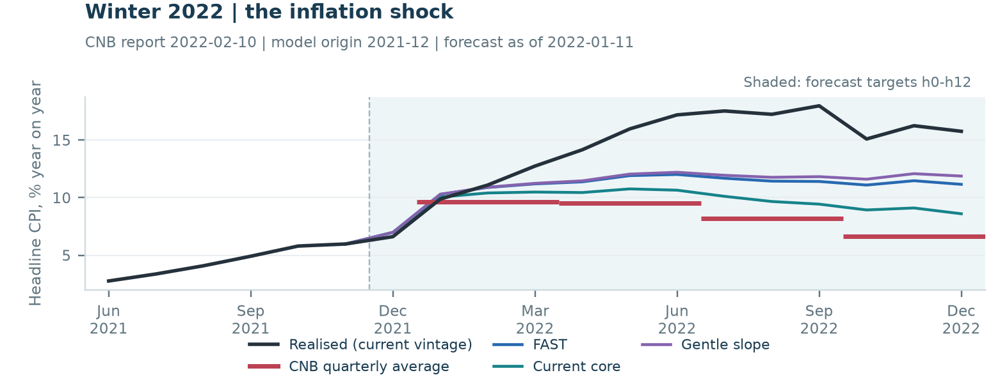
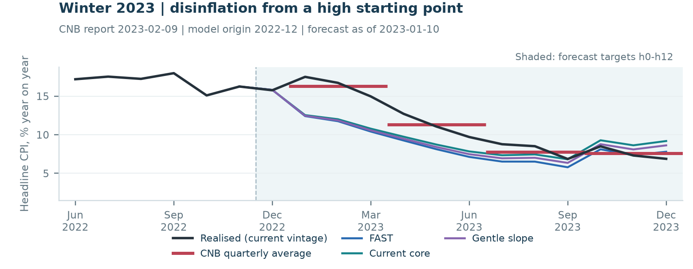
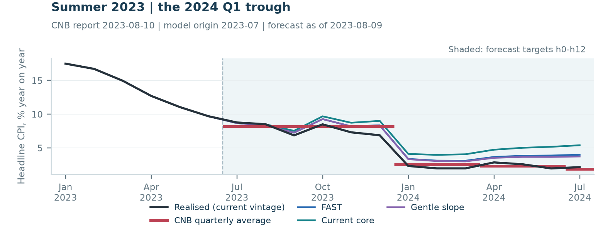
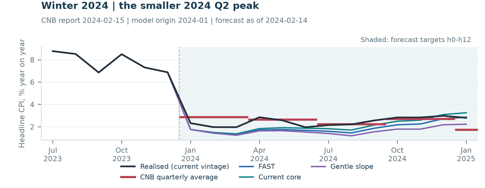
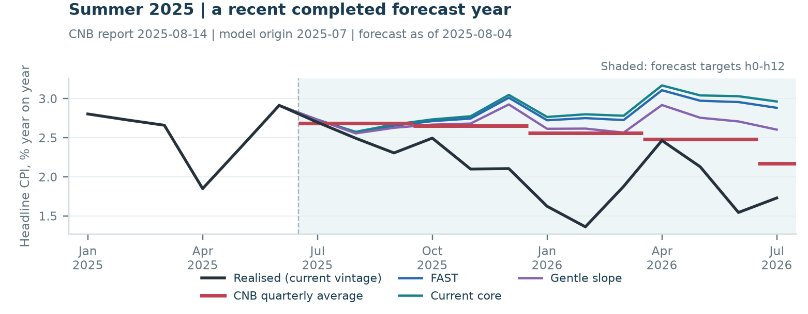
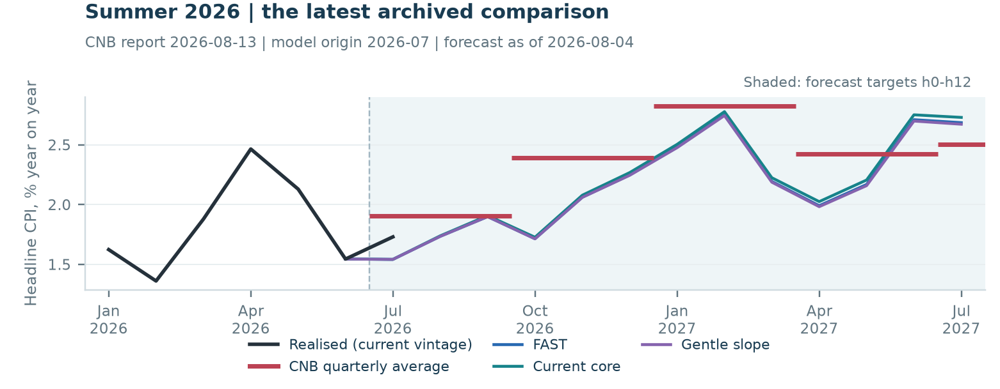
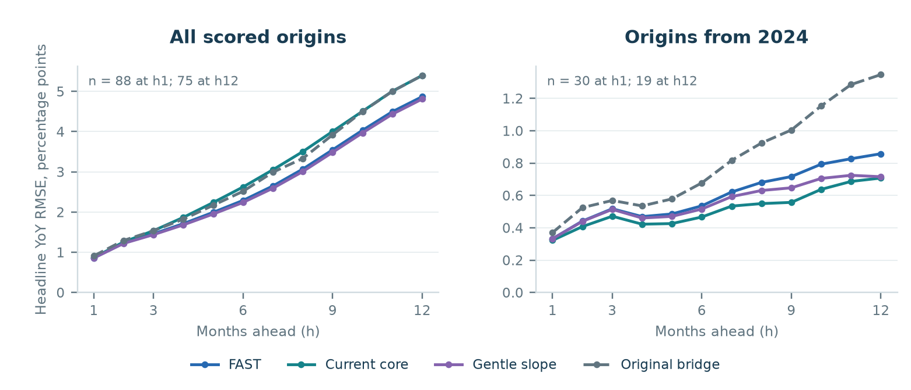
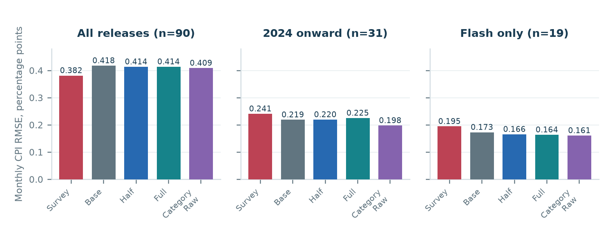
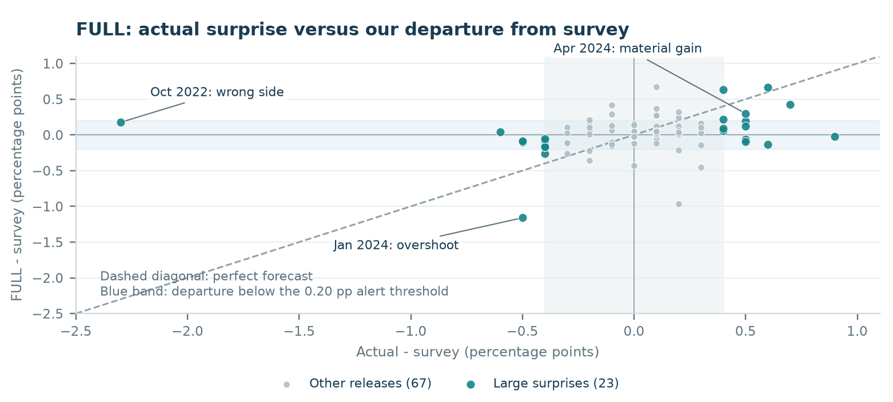
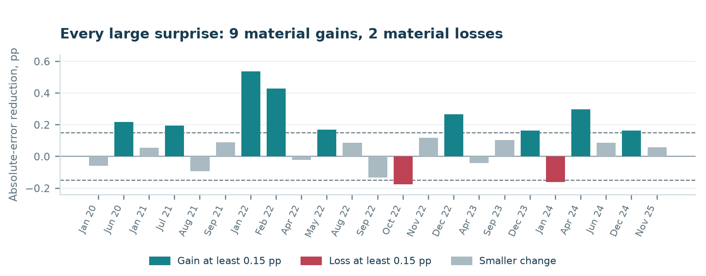

# CZK Cpi Forecasting - Latest models

Model explanation and evidence for internal discussion | 14 September 2026

## 1. What we have, and what we can defend

We have an independent component-based forecast of the next Czech CPI release, and a separate family of monthly inflation paths extending from the nowcast month to twelve months later. The framework is economically interpretable and extensively checked. Its historical performance is promising in specific respects, but it has not established consistent superiority over consensus or CNB, reliable advance turning-point prediction, or profitable rates trading.

The most defensible description is: **an independently constructed inflation forecast and scenario framework, with competitive recent nowcast accuracy and some meaningful historical surprise capture, supported by reproducible component accounting and explicitly limited historical evidence.**

The main nowcast does not use release consensus, professional inflation expectations, household inflation expectations or sentiment. CNB paths and release consensus enter the comparisons only. Optional legacy/expectations-conditioned models are separate. The strongest current path candidates are much smaller than the full collected-variable inventory: more available inputs did not consistently improve out-of-sample forecasts.

| Product | Main purpose | Practical roster |
|---|---|---|
| Next-release nowcast | Predict the first published monthly CPI change | Independent BASE; HALF and FULL corrections alongside it; Category Raw as accuracy challenger |
| Inflation path | Produce a coherent monthly CPI and annual-inflation trajectory | FAST, current core and gentle slope; common noncore components |
| Conditional scenarios | Explain alternative market/policy assumptions | Annual-index fuel conditioning and labelled household-energy bill scenarios |
| Research archive | Preserve hypotheses and negative findings | Other category, state, elastic-net, forest and combination variants |

The nowcast scoreboard contains 90 monthly first releases, February 2019 to July 2026. It compares ordinary first releases before 2025 and flash with flash from January 2025. The archived forecast for each is a release-eve forecast; these are not demonstrated month-ahead forecasts. Longer raw histories supply training, but do not create additional common scored releases.

The path sample uses those same 90 monthly origins, with fewer realised endpoints as the horizon grows. Its latest frozen origin is July 2026. A historical forecast date is reconstructed from the archived inputs and release rules; it is not evidence that this project published that forecast at the time.

The nowcast is the more immediately useful independent cross-check. The paths are credible research tools for inflation persistence, base effects, components and scenarios. They remain a weaker basis for a claim of a repeatable turning-point advantage.

<!-- PAGEBREAK -->

## 2. How the independent nowcast works

The predicted monthly headline change is a weighted combination of core, food, fuel, administered prices and alcohol/tobacco, plus a reconciliation wedge. Each block uses the information most suited to it. The statistical projection is explicit; it is not claimed to reproduce the official CPI aggregation formula exactly.

| Block | What enters | Forecasting method and economic logic |
|---|---|---|
| Core | Core monthly inflation at lags 1, 2 and 12; previous services inflation; lagged import prices; available EUR/CZK change; calendar months; lagged inflation state | Expanding ridge regression: shrink coefficients while allowing persistence, seasonality and cost pressure. FX/import slopes may differ when lagged annual inflation exceeds 4%. |
| Food and non-alcoholic beverages | Food CPI lags 1 and 12; agricultural-price changes for preceding months; lagged Czech food-products PPI | X-13 fitted separately at each origin, ridge on seasonally adjusted food inflation, then destination-month seasonality added back. A documented ridge fallback handles X-13 failure. |
| Fuel | Weekly Czech petrol and diesel pump prices, including taxes; dated basket petrol/diesel shares | Separate monthly price relatives, then weighted combination. Unobserved weekly observations are carried forward under the declared rule. |
| Administered prices | Released regulated-price history; qualifying dated announcements and effective periods | Seasonal baseline with a gated announcement override where the scored specification admits it. Policy treatment and exposure are critical. |
| Alcohol and tobacco | Separate division-02 monthly CPI history | Expanding mean for the destination calendar month, subject to released-history rules. Separate from the food division used here. |
| Reconciliation wedge | Historical difference between observed headline and the weighted block projection | Seasonal forecast of what the approximate block system does not explain. It is not a directly observed economic sector. |

The nowcast's agricultural proxy uses seven farmgate products: food wheat, cow's milk, eggs, slaughter pigs, chickens, consumption potatoes and apples. It averages available product log-price changes. This proxy is not an official food-CPI weighted basket; the number of available products can matter. The later path-food experiment's agri4 input is a different defined series.

Food, fuel and alcohol weights use archived basket anchors with effective-year and availability rules. The administered coefficient is estimated from previously released outcomes, constrained to a range; core is the residual weight. Therefore an administered coefficient around 16-17% is a projection coefficient, not a claim that CNB's official regulated-price share equals that number. Weights summing to one do not remove conceptual differences or the wedge.

The main ridge uses standardized predictors, training-sample imputation, a fixed penalty of 3 and a minimum 48 observations. Coefficients are re-estimated as history expands. The penalty is a model-design choice; it was not exhaustively optimized across every possible setting. Wages are excluded from this specification because the earlier interpolated series had a timing problem.

Important weaknesses are policy-to-household-bill mapping, proxy aggregation, incomplete release vintages, imputation and changing seasonal patterns. A missing-input fallback keeps a calculation running; it does not prove that forecast quality is unchanged. Availability diagnostics belong next to the point forecast.

<!-- PAGEBREAK -->

## 3. BASE, HALF, FULL and Categories: what the names mean

**BASE / HARD_BASE / R9_BASE** identify the uncorrected independent aggregate-core nowcast in the relevant output files. “Raw” means before the learned error adjustment, not raw unprocessed data.

**HALF and FULL** learn to forecast errors previously made by that same independent core model. At each historical origin the raw core forecast is saved. Only after its detailed core outcome is published can its error become a training label. A quantile regression forest predicts the next core error using the independent feature frame.

**HALF = BASE + 0.5 x current core weight x predicted core error.**

**FULL = BASE + 1.0 x current core weight x predicted core error.**

For example, with BASE at 0.30%, a core weight of 0.50 and a predicted core underforecast of 0.10 pp, HALF is 0.325% and FULL is 0.350%. Neither formula moves toward consensus. “Half” is half the predicted error correction, not half confidence or a 50% success probability.

The retained correction uses 200 trees, minimum leaf 3, all features eligible at each split, seed 42, and five conditional quantiles: 10%, 25%, 50%, 75% and 90%. Constrained weights combine these quantiles into a point forecast using a recent held-out error window, with greater weight on recent validation errors. It requires 40 released errors. The quantile outputs are not thereby certified probability bands for headline inflation or rates returns.

The **Category** family replaces aggregate core prediction with separate ridge forecasts for actual rent, imputed rent, catering, accommodation and package holidays, plus a fitted remainder. Each uses its own inflation lags and calendar months. The remainder reconciles those tax-including service categories to the target core contribution. These are useful granular signals, not a complete official services/goods partition.

Category Raw, Category Half and Category Full exist. Their corrections use category-model errors, not BASE errors. Category data begin in 2015, so usable forecast errors begin only in 2019; its correction is zero for the initial 40 scored releases and begins operating in June 2022. Matched-history BASE controls were also tested so this shorter warmup was not mistaken for an architectural advantage.

| Family | Raw | Half error adjustment | Full error adjustment |
|---|---|---|---|
| Aggregate core | HARD_BASE | HARD_HALF | HARD_FULL |
| Category core | CATEGORY_RAW | CATEGORY_HALF_CORRECTION | CATEGORY_FULL_CORRECTION |

The original Claude BASE_RIDGE/PAST_HALF/PAST_FULL lineage contains expectations and sentiment and is archived separately. LEGACY_* permits comparison with that lineage. It should not be relabelled independent. ESI-only additions were tested and did not earn inclusion. The old TVW-QRF/X-13 stack is historical research, not an extra current operating forecast to average automatically.

My preferred display is BASE, HALF, FULL and Category Raw. HALF is a legitimate conservative challenger; FULL is worth monitoring for large-surprise capture. Their small differences do not justify presenting one as a proven universal winner. Category corrections add little to its raw forecast and reduce recent accuracy.

<!-- PAGEBREAK -->

## 4. Nowcast accuracy and meaningful surprise capture

All figures below use matched first-release outcomes and consensus for that same release stage. Units are percentage points of monthly inflation. RMSE penalizes large mistakes more heavily; MAE is average absolute error. Lower is better.

| Nowcast | RMSE, all 90 | RMSE, 2024+ (31) | RMSE, flash era (19) |
|---|---:|---:|---:|
| Consensus | 0.3815 | 0.2410 | 0.1947 |
| BASE | 0.4180 | 0.2190 | 0.1730 |
| HALF | 0.4137 | 0.2196 | 0.1656 |
| FULL | 0.4139 | 0.2253 | 0.1638 |
| Category Raw | 0.4089 | 0.1978 | 0.1610 |
| Category Half | 0.4094 | 0.2006 | 0.1648 |
| Category Full | 0.4110 | 0.2047 | 0.1706 |

The independent models lose to consensus over the full sample. They perform better in the recent and flash-era samples; Category Raw is the strongest accuracy challenger in this table. Since 2024 its RMSE is about 18% below consensus. That is a useful historical result, not established statistical or prospective superiority.

A **large surprise** is an absolute actual-minus-consensus difference of at least 0.40 pp. There are 23. A **material win** requires at least 0.15 pp less absolute error than consensus; a material loss uses the same symmetric threshold. Direction alone does not earn a material win.

| On 23 large surprises | MAE | Correct side of consensus | Material wins / losses | Median signed capture |
|---|---:|---:|---:|---:|
| Consensus | 0.5783 | - | - | - |
| BASE | 0.4846 | 17 / 23 | 7 / 3 | 24% |
| HALF | 0.4794 | 16 / 23 | 7 / 1 | 24% |
| FULL | 0.4761 | 17 / 23 | 9 / 2 | 22% |
| Category Raw | 0.5120 | 13 / 23 | 8 / 2 | 17% |
| Category Half | 0.5084 | 13 / 23 | 9 / 2 | 18% |
| Category Full | 0.5047 | 13 / 23 | 9 / 2 | 19% |

Capture = (forecast - consensus) / (actual - consensus). One means exact capture; zero means no deviation; a negative number means the wrong direction. Overshoot beyond two is worse than consensus in absolute error. FULL's 22% median capture shows that correct direction often captures only part of the eventual surprise. Its conditional MAE is about 18% lower than consensus, but only 9 of 23 events are material wins; 12 are neither material wins nor losses.

Only five of the large surprises are in 2024 onward, and only one is in the flash era. The 23-event result therefore cannot be advertised as a separately established flash-surprise advantage. Excluding January leaves FULL at MAE 0.4906 versus consensus 0.5947, with 8 material wins and 1 loss on 19 events; that sensitivity does not eliminate other policy and vintage risks.

Source: recomputed corrected release rows and R13 category rows; [saved summary](work/model_briefing_20260914/nowcast_summary.csv), [all large-event evidence](work/model_briefing_20260914/nowcast_large_events.csv).

<!-- PAGEBREAK -->

## 5. What happens when the model actually disagrees with consensus?

Conditioning on a realised large surprise asks: “When the surprise happened, was the model useful?” A decision rule needs another question: “When the model told us to expect a large deviation, what happened next?” The first question selects events after knowing the answer. The second includes false alarms.

An **alert** here means absolute forecast-minus-consensus of at least 0.20 pp, known before the release. The rule uses consensus to evaluate disagreement, not to construct the forecast.

| Forecast | Alerts | Alerts that became big surprises | Big alerts with material gain | MAE on alerts | Consensus MAE on those same alerts |
|---|---:|---:|---:|---:|---:|
| BASE | 20 | 7 | 5 | 0.4091 | 0.3700 |
| HALF | 22 | 7 | 5 | 0.4037 | 0.3545 |
| FULL | 23 | 7 | 6 | 0.3213 | 0.2652 |
| Category Raw | 21 | 9 | 6 | 0.3445 | 0.3524 |

FULL's seven big alerts all had the correct direction, but this is **7 out of 23 alerts**, not a 100% all-release success rate. Six of the 23 alerts delivered a material gain on a big surprise. Sixteen alerts did not become big surprises, and sixteen of the 23 actual big surprises were not flagged by FULL at this threshold. A non-big alert is not necessarily a harmful forecast, so the absolute-error comparison is reported as well.

On all FULL alerts, there are 9 material wins and 10 material losses, with total absolute-error improvement of -1.2905 pp across those events. This is not trading P&L. Category Raw has a small positive average alert advantage of 0.0079 pp, only 0.1654 pp summed over 21 alerts. It deserves monitoring, not a strong trading claim.

Concrete FULL cases, all monthly-CPI percentage points:

| Target month | Consensus | Forecast | First release | Absolute-error gain |
|---|---:|---:|---:|---:|
| February 2022 | 0.600 | 1.028 | 1.300 | +0.428 |
| April 2024 | 0.200 | 0.498 | 0.700 | +0.298 |
| October 2022 | 0.900 | 1.075 | -1.400 | -0.175 |
| January 2024 | 2.000 | 0.840 | 1.500 | -0.160 |

April 2024 illustrates the desired behaviour: a sizeable deviation in the correct direction and a materially closer number. January 2024 illustrates why direction is insufficient: the forecast was correctly below consensus but overshot too far, capturing 232% of the surprise and becoming less accurate. October 2022 exposes the importance of energy-policy measurement.

**The defensible claim:** FULL improved average accuracy conditional on historical large surprises. **The unsupported stronger claim:** FULL reliably identifies profitable large surprises in advance. A rates strategy needs prospective forecasts, entry/exit timing, market-reaction targets and trading costs, not just CPI error scores.

<!-- PAGEBREAK -->

## 6. How the inflation path is constructed

The path is not a line drawn between h3, h6 and h12. Every model has monthly forecasts h0 through h12, and annual inflation is calculated from a single origin's monthly price changes. For a July origin, h0 is July and h12 is July of the following year. All current comparisons start with the identical independent HARD_BASE h0.

Headline annual inflation at a future target is 100 times the twelve-month product of gross monthly price changes, minus 100. Known months use the historical data admitted to that origin; unknown months use that origin's forecasts. A high or low month dropping out of this twelve-month window creates a base effect. Annual inflation can therefore turn without a fresh turn in underlying monthly price pressure.

The leading path variants share the stable food, constant-pump fuel, administered-price, alcohol/tobacco and wedge paths. Food uses a small shrinkage model of agricultural, processor and retail-food monthly log-price changes, with six lags, calendar seasonality and a stability constraint. Fuel's central comparison holds the pump-price level flat after the inherited near-term alignment. That is an assumption, not a prediction that oil never changes. The annual-index fuel scenario changes that conditioning assumption through separate petrol/diesel transmission equations.

The main differences are in **future core inflation**:

| Path | Core mechanism | What it assumes |
|---|---|---|
| Current core: STABLE_LOCAL_CORE_R14B | Hold the current trend, measured by the last twelve monthly log rates, then add destination seasonality | Today's estimated underlying pace is a useful medium-term baseline. It is not simply the last monthly print. |
| FAST: STATE_FAST_R15 | Kalman-filtered persistent trend plus a temporary component that decays by 20% each month, plus seasonality | Recent evidence can change the persistent pace quickly; some pressure fades. No fixed 2% anchor. |
| Gentle slope: DAMPED_P95_Q001_R16 | Trend, a gradually decaying trend slope, temporary component and seasonality | Persistent inflation can continue accelerating/decelerating, with the slope gradually fading. |
| Original bridge | Separate direct-horizon component regressions using the origin's available predictors | Historical predictor relationships remain useful at each horizon. Retained as a benchmark. |

FAST's expected adjusted core pace at t+h is **trend + 0.8^(h+1) x temporary pressure**. The extra transition occurs because the last observed core is t-1. Its fixed trend-innovation variance ratio is 0.20, temporary ratio 0.20 and observation ratio 1. These determine responsiveness; they do not identify shocks causally.

Gentle slope adds a slope with persistence 0.95 and a small innovation ratio 0.001, alongside level ratio 0.05 and temporary ratio 0.20. Those settings were declared and compared, not treated as economic constants. FAST is usually more responsive to a changed current pace; gentle slope can carry a developing trend further into the future.

Separating persistent and temporary inflation is consistent with the research motivation in [Stock and Watson](https://www.nber.org/papers/w21282). Our small fixed-variance filter is not their multivariate stochastic-volatility model and does not inherit their empirical results.

<!-- PAGEBREAK -->

## 7. What happened to the larger models and combinations?

R15 tested elastic nets on domestic signals, imported-cost signals, both groups and a wider hard-data set. Domestic predictors include services prices, unemployment, industrial production and labour costs. Imported signals include goods prices, import/producer prices, FX, German HICP and commodities. A residual forest uses both groups. These learn corrections to a saved trend baseline rather than forecasting unrestricted headline levels alone.

The baseline can move beyond previously observed inflation levels. The forest correction remains constrained by its historical residual support. This addresses one extrapolation weakness of a level forest, but it does not manufacture information about future shocks. Larger predictor sets and elastic nets did not consistently beat FAST. Strong shrinkage often selected almost no extra adjustment.

R16 tested damped slopes and separately forecast broad services/goods signals. R17 tested robust shock handling, repeated news, propagation of independent h0 information, asymmetric food costs, monthly category signals, energy conditioning and combinations. Some changes helped a component or an era, but the all-components blend did not establish a better whole path.

Chronological parameter selection was used where specified. Candidate forecasts were saved at their own historical origins; selection could use them only after their outcomes matured. It did not select on CNB proximity or the current forecast's future error. This addresses leakage inside selection, but repeated research on the same sample still creates a model-selection risk.

There is also a separate CNB-paper-inspired TVW-QRF lane: many macro, market and optional survey variables predict conditional inflation quantiles, whose combination weights change with recent forecasting performance. [CNB WP 9/2026](https://www.cnb.cz/cs/ekonomicky-vyzkum/publikace-vyzkumu/cnb-working-paper-series/AI-Based-Forecasting-of-Czech-Inflation-Quantile-Regression-Forests-with-Dynamic-Weights) provides the research motivation. Our source substitutions, timing choices and corrected weighting runner must be disclosed. The paper's results are not a certificate of our replication or our path accuracy. Pre-correction exports should not be used to support performance claims.

Legacy F1b is a component-path lineage; F2 is a trend/gap comparison with professional expectations as a measurement; E7 is a survey-free target-anchored comparison. BVAR, target/FX/labour models and the original level forests remain benchmarks/research. They are not interchangeable with the independent FAST/current-core/gentle-slope trio. An archive of alternatives is useful; averaging every archived model without a declared selection rule is not.

The practical recommendation is a small display: **three independent paths plus explicit energy scenarios**. Their disagreement is model sensitivity, not a calibrated confidence interval. Keep the category diagnostics because they help explain price pressure, while recognizing that they have not produced a superior mapped core path.

Code/data quality and predictive quality are different. The R17 round had 347 passing tests and extensive numerical reconstruction. That supports the interpretation that its reported negative results are real results rather than known arithmetic defects. It does not imply that the current economic assumptions are optimal or that every unknown defect has been excluded.

<!-- PAGEBREAK -->

## 8. Path accuracy and the CNB comparison

The first table scores annual headline CPI at fixed monthly horizons on the original common calendar. Full h3/h6/h12 have 84/81/75 realised forecasts; recent h12 has 19. “Recent” means forecast origins from January 2024, not merely outcomes dated after 2024.

| Path | Full h3 RMSE | Full h6 RMSE | Full h12 RMSE | Recent h12 RMSE |
|---|---:|---:|---:|---:|
| Original independent bridge | 1.537 | 2.516 | 5.395 | 1.347 |
| Current core | 1.537 | 2.624 | 5.397 | 0.708 |
| FAST | 1.459 | 2.290 | 4.870 | 0.858 |
| Gentle slope | 1.439 | 2.240 | 4.810 | 0.716 |
| R17 repeated-news core | 1.420 | 2.181 | 4.771 | 0.843 |
| R17 all-components blend | 1.528 | 2.367 | 5.021 | 0.794 |

FAST improves materially on the original bridge in full history; current core is stronger recently. Gentle slope is a useful sensitivity, but lower headline error does not necessarily mean better core prediction. R16/R17 decomposition found cases where weaker core errors offset retained food/admin/fuel errors more favourably. We should not defend those offsets as superior economic mechanisms.

CNB comparisons average annual inflation over complete quarters. The 66 full report/quarter pairs contain only 18 distinct realised quarters and 18 scoreable reports, with overlapping horizons. They are not 66 independent economic events. We retain both the report-publication clock and a separate CNB-information-cutoff comparison.

| Report-clock comparison | Model MAE | CNB MAE | Model RMSE | CNB RMSE | Material model gains / losses |
|---|---:|---:|---:|---:|---:|
| FAST, all 66 pairs | 1.260 | 1.061 | 1.987 | 2.295 | 15 / 32 |
| Repeated-news core, all 66 | 1.219 | 1.061 | 1.835 | 2.295 | 11 / 35 |
| Current core, recent 34 | 0.275 | 0.287 | 0.402 | 0.372 | 8 / 9 |

The full-history RMSE advantage is concentrated. Omitting the February 2022 report reverses it: FAST RMSE 1.739, repeated-news 1.660, CNB 1.476. This sensitivity does not delete the difficult episode from the main results; it reveals how dependent the apparent advantage is on that one round.

For 13 pairs where CNB's eventual absolute error was at least 1 pp, repeated-news has 9 material gains and 4 losses. All 13 are from four reports in 2022 and six distinct quarters. A higher inflation baseline helped during some huge misses; this does not show that the model foresaw the war or consistently anticipated new shocks.

My assessment: the recent paths are substantially more credible than the original bridge, but no consistent CNB advantage is established. Unforeseeable shocks can make sensible forecasts wrong. Equally, a large miss cannot automatically be excused as unforeseeable. The forecast's assumptions, changes in those assumptions and component errors must be examined separately.

<!-- PAGEBREAK -->

## 9. How often did we anticipate a turn before CNB?

I calculated a new descriptive check specifically for this question. It uses the already frozen forecasts, not newly fitted models. A headline turn is a peak/trough in quarterly-average annual CPI, with both adjacent changes at least **0.25 pp** and opposite signs. The model and CNB must have all three quarters; the centre quarter must not have ended. A correct call needs the exact quarter and direction. All usable centres in this comparison are fully future quarters.

There are **31 comparable report/centre-quarter opportunities**, containing ten turn opportunities but only **five distinct realised turns**. Repeated forecasts of the same turn are not additional independent successes.

| Path, report clock | Turn calls | Correct calls | False calls | Distinct turns correctly anticipated |
|---|---:|---:|---:|---:|
| FAST | 9 | 2 | 7 | 1 |
| Current core | 8 | 2 | 6 | 1 |
| Gentle slope | 9 | 2 | 7 | 1 |
| CNB on identical triples | 2 | 0 | 2 | 0 |

The one shared success is the **2024 Q1 trough**, anticipated in the August and November 2023 report rounds. These two calls represent one event. All 30 R17 paths captured that event, which also cautions against crediting it to a particular new core engine.

The August 2023 comparison is revealing:

| Annual CPI, quarterly average | 2023 Q4 | 2024 Q1 | 2024 Q2 |
|---|---:|---:|---:|
| Realised | 7.564 | 2.086 | 2.462 |
| CNB | 8.189 | 2.549 | 2.348 |
| FAST | 8.611 | 3.197 | 3.790 |
| Gentle slope | 8.598 | 3.126 | 3.618 |

Our paths forecast the fall and then rebound; CNB forecast continued decline into Q2. However, **CNB was closer on inflation levels**, while our rebound began from too high a level. This supports a correct shape call, not superior overall accuracy for that episode. Shared base effects and noncore assumptions can produce the headline trough without anticipation of a new underlying-core turn.

To claim “model first, CNB later,” I separately searched all archived CNB vintages, including its longer forecast coverage. At the 0.25 pp definition there are **zero demonstrated model-first-then-CNB-later sequences**: CNB did not issue a qualifying advance call of that same trough before the event. The precise positive claim is one model-only correctly anticipated trough in the available archive, not an estimated number of months by which we led a later CNB call.

The report and cutoff clocks give the same primary counts. This is a small retrospective sample beginning with the 2022 CNB reports; it cannot establish a stable turning-point success rate.

<!-- PAGEBREAK -->

## 10. Smaller turns, underlying core and the practical verdict

At the more permissive **0.10 pp** threshold, gentle slope correctly anticipates five distinct headline turns. For one of them, the **2024 Q2 peak**, its first correct comparison is the February 2024 report round, while CNB first calls it in the May 2024 round: one round, or 84 days between reports, earlier. This result appears at both clocks. The decline after that peak was only about 0.16 pp, so it does not qualify under the primary 0.25 pp rule.

That smaller-turn result still has substantial false calls: gentle slope makes 17 calls, 9 correct and 8 false, across the 31 report-clock opportunities. Those nine hits concern five distinct turns, and CNB had already called some of those other turns earlier. At a 0.50 pp threshold, none of the three reference paths correctly calls a qualifying turn. The answer changes with the definition; it should not be reduced to the most flattering hit rate.

**Underlying-core turns are a separate and harder test.** The earlier fixed diagnostic removes seasonality and looks for opposite changes of at least 0.5 pp in annualized core pace across adjacent three-month bands. Among 159 overlapping opportunities with 77 actual turns, FAST and current core make zero qualifying calls. The original bridge has 11 hits and 27 false turns; the residual forest has 3 hits and 17 false turns. Those are core-band events, not CNB headline-quarter comparisons. We do not have a comparable archived CNB core path here, so they cannot establish a core-turn lead over CNB.

FAST's expected trend is flat beyond the origin and its temporary component decays monotonically. It can react rapidly when new data arrive, but it cannot generate a fresh interior reversal in seasonally adjusted core by itself. Adding a slope or nonlinear residual makes turns possible, but our tested versions have not made them reliably predictable. Updating quickly after a turn and forecasting it before it happens are different capabilities.

| Claim to use at work | Qualification to give with it |
|---|---|
| The nowcast is independently constructed | Consensus and inflation expectations do not enter the main forecast; legacy comparisons are separately labelled |
| Recent nowcast accuracy is competitive | Full-history consensus still wins; only 31 recent and 19 flash observations |
| FULL captured meaningful portions of some large surprises | 9 material wins / 2 losses conditional on 23 big events; all-alert results do not establish a reliable advance signal |
| We have a concrete headline-turn example | 2024 Q1 trough, one event seen in two rounds; levels still too high |
| One smaller peak was called one CNB round earlier | Gentle slope, 2024 Q2, only under the 0.10 pp sensitivity |
| The framework is reproducible and numerically checked | Tests cannot establish economic optimality, genuine historical vintages or live trading returns |

The immediate priorities are a recorded prospective forecast/input archive; a complete dated household-energy tariff and contract-exposure model; explicit explanations of path revisions and component contributions; and a prospective decision rule evaluated with false alarms and rates-market outcomes. More unrestricted parameter search is not the first priority.

Recommended operating discipline: retain independent BASE with HALF/FULL and Category Raw as comparisons; display FAST/current-core/gentle-slope paths and explicit energy assumptions; publish the actual disagreement with consensus/CNB without moving forecasts toward them to improve the presentation. State uncertainty honestly and record every future call before its outcome.

Evidence: [complete R17 assessment](R17_RESULTS_2026-09-14.md), [R17 replay](output/research_r17/path/evaluation/cnb_rounds_replayed_r17.html), [new turn-event ledger](work/model_briefing_20260914/headline_turn_event_priority.csv), [all turn opportunities and false calls](work/model_briefing_20260914/headline_turn_opportunities.csv), [analysis definition](work/model_briefing_20260914/ANALYSIS_SCOPE.md), [source hashes](work/model_briefing_20260914/manifest.json).

The new briefing recalculation agrees with the corrected nowcast scoreboards and independently vectorized turn classifications. Previous model/forecast files were not changed. Full data-vintage certification, calibrated path probabilities, and a live rates-trading record remain outside what this evidence establishes.

<!-- PAGEBREAK -->

## 11. Forecast paths through the inflation shock

These six selected rounds illustrate strengths and weaknesses; the complete-sample charts follow on page 14. Black is realised monthly annual inflation, viewed with hindsight. Our coloured lines are frozen monthly paths. **Red segments are CNB quarterly averages, not monthly forecasts.** Shading marks the model's target months h0-h12; h0 is the release being forecast, which can refer to an already-ended month.

The 2022 shock exposed major errors across forecasts. This report round materially influences the apparent full-sample RMSE advantage over CNB: removing it reverses the FAST/CNB ranking. A higher projected inflation level does not mean the model anticipated the war.

The model's dated snapshot precedes the February report. In every panel, the subtitle shows both dates: these are archived round comparisons, not a claim of identical information cutoffs. Direction, speed and level all matter; predicting disinflation alone is insufficient.

Source: Frozen R17 replay, report clock. Models share the same nowcast anchor and noncore assumptions. Realised CPI is the current historical vintage. Forecasts have not been refitted for these figures.

<!-- PAGEBREAK -->

## 12. The turning-point examples, in context

Monthly curves help explain the forecast shape. The turn counts in sections 9-10 are calculated on complete quarterly averages with a fixed threshold; they are not visual judgements about small monthly fluctuations.

**2024 Q1 trough:** our paths anticipated a rebound into Q2, while CNB forecast further decline. This is the primary diagnostic's one distinct success, seen in two report rounds. Our levels were too high; CNB was closer on levels across the three quarters. Shared base effects and noncore assumptions also contribute to this shape.

**2024 Q2 peak:** gentle slope called this in the February round, one CNB round earlier under the 0.10 pp sensitivity. The realised decline into Q3 was only about 0.16 pp. It does not qualify as a success under the primary 0.25 pp rule, and smaller-turn calls also produced many false alarms.

Source: Frozen R17 report-clock paths and the separately defined turn-event ledger. Red segments show quarterly averages. Selected successes must be read alongside the complete false-call counts in sections 9-10.

<!-- PAGEBREAK -->

## 13. Recent and latest archived paths

These panels show how the same three reference engines behave in a lower-inflation environment. Their disagreement mainly illustrates different assumptions about core persistence and slope; it is not a calibrated confidence interval.

The summer 2025 path can now be followed through its final target month in the frozen dataset. A model can remain economically plausible yet miss the timing or size of individual monthly movements. Compare the entire path, not just whether its endpoint approaches CNB's endpoint.

**This is the latest archived comparison, not a live September forecast.** The model origin is July 2026 and the snapshot is dated 4 August; realised monthly CPI in this export ends in July 2026. Beyond that, there is no outcome line. Constant-pump fuel and the shared food/admin assumptions remain consequential conditioning choices.

Source: Frozen R17 replay. CNB red segments remain quarterly averages; model lines are monthly annual CPI. A current trading briefing would require refreshed, timestamped inputs and a newly recorded forecast.

<!-- PAGEBREAK -->

## 14. Accuracy across the sample

Lower RMSE means smaller squared forecast errors. These scorecards include the whole declared sample in each panel, rather than the six selected report examples. The left and right path panels use different vertical scales; long-horizon samples contain fewer realised outcomes and overlapping forecast errors.

The recent paths improve substantially on the original bridge. FAST's responsiveness helps on the full-history endpoint, while current core and gentle slope have lower recent h12 errors. This does not establish a universally best engine. These monthly-origin scores are a different comparison from CNB's quarterly report-round scores in section 8.

The survey wins on full-history nowcast RMSE; the independent models are competitive in the recent and flash samples. Category Raw leads the models shown in those recent panels, while FULL has stronger conditional large-surprise capture. Flash history contains only 19 releases and one large surprise, so it is too short to settle model selection.

Source: Fixed R17 horizon scoreboard and independently recomputed release-matched nowcast evidence. Path errors concern annual inflation; nowcast errors concern monthly inflation. Their magnitudes are not directly comparable.

<!-- PAGEBREAK -->

## 15. Do we meaningfully capture large surprises?

Each point below is a release, with FULL's disagreement against survey on the vertical axis and the realised surprise on the horizontal axis. The diagonal is a perfect forecast. The grey vertical band contains surprises smaller than 0.40 pp; the blue horizontal band contains departures smaller than the 0.20 pp alert threshold.

Getting the sign right is insufficient: January 2024 was on the right side but overshot enough to worsen the forecast. October 2022 was a major wrong-side miss. April 2024 illustrates the intended outcome: a substantial departure that meaningfully reduces the error.

The bar height is **survey absolute error minus FULL absolute error**. Across all 23 large surprises, FULL has 9 material gains and 2 material losses at 0.15 pp, with 17 correct directions. But the advance-alert test is weaker: only 7 of FULL's 23 alerts coincide with large surprises, and its MAE on all alerts is 0.321 versus survey's 0.265. Conditional capture has not yet become a reliable advance signal.

Source: Matched first-release outcomes, February 2019-July 2026. Every large surprise is shown; the chronology skips non-large releases. Historical policy reconstruction and revised-input limitations still apply. No model or threshold was refitted for the charts.
