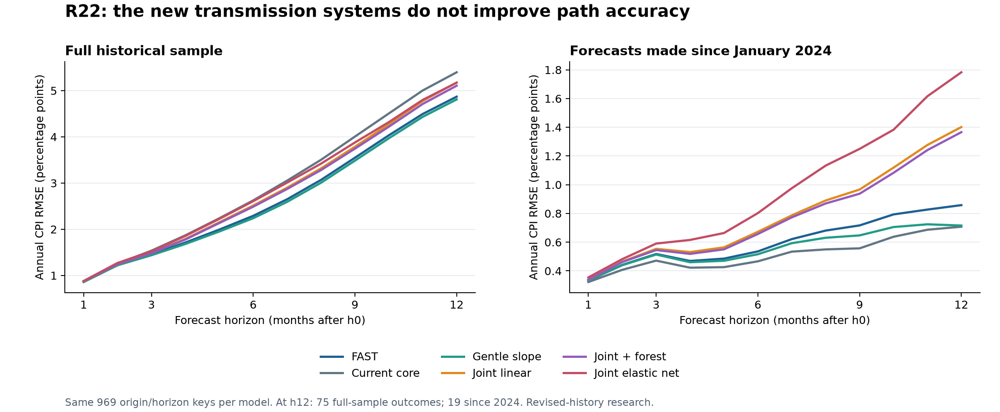
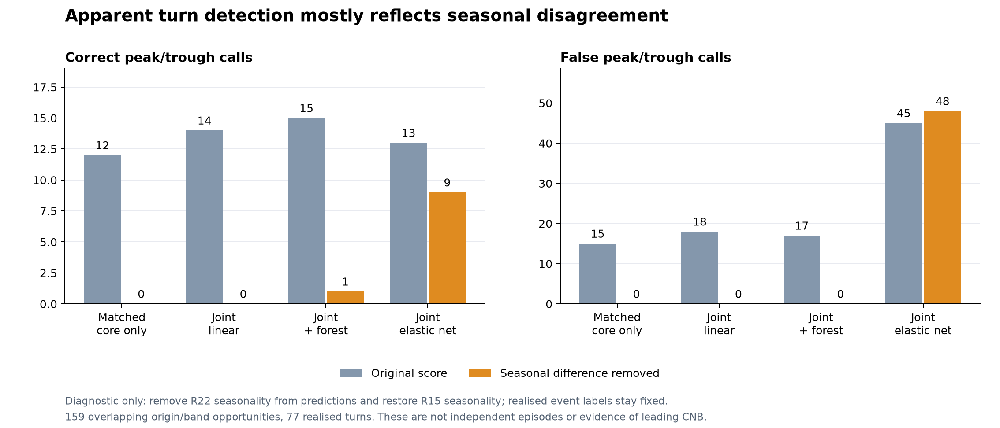
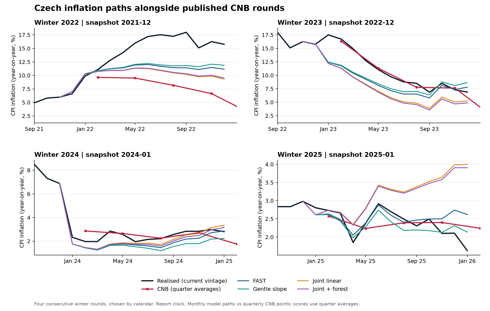

# Czech CPI forecasting: R22 path transmission research

15 September 2026. Seven fixed candidates, 90 historical origins, all monthly horizons h0–h12. Research status: **complete; no candidate promoted.** The independent next-release nowcast remains unchanged.

The joint domestic/imported systems are correctly implemented as specified, but they do not improve the headline path over the existing references. The exercise also exposed a misleading interpretation of apparent turning-point gains: most came from different seasonal estimates. This is useful negative evidence, not evidence that adding economic variables cannot ever work.

[Interactive CNB rounds replay](output/research_r22/full/evaluation/cnb_rounds_replayed_r22.html) · [Declared specification](docs/implementation/R22_TRANSMISSION_SPEC_2026-09-15.md) · [Independent review](work/research_r22_review/REVIEW.md) · [Delivery manifest](output/research_r22/DELIVERY_MANIFEST.json)



## What was built

The idea was to forecast the development of domestic and imported inflation pressure, rather than use macro data only to correct previous inflation forecast errors. Every system advances monthly, predicts CNB core inflation, and substitutes that core prediction into the existing FAST component path. Food, fuel, administered prices, alcohol/tobacco, basket weights and independent headline h0 are identical across candidates.

The domestic measurements are statistical proxies for services prices and housing prices, unemployment, quarterly nominal unit labour costs, and industrial production. Imported pressure uses a goods-price proxy, import prices, manufactured PPI, EUR/CZK, Brent and industrial metals. CNB core is a separately observed target. The category proxies are incomplete equal-weight averages, not official expenditure-weighted CNB core subdivisions.

| Candidate | Test |
|---|---|
| JOINT_OWN_R22 | Core alone; same training dates, seasonal method and shrinkage as the larger systems |
| JOINT_DOMESTIC_R22 | Core plus domestic measurements |
| JOINT_IMPORTED_R22 | Core plus imported-cost measurements |
| JOINT_LINEAR_R22 | Joint 12-variable Bayesian-ridge point estimate |
| JOINT_ENET_R22 | Joint system with elastic-net regularization |
| JOINT_RF_R22 | Joint linear system plus half-strength forest prediction of the core equation residual |
| JOINT_HALF_R22 | Half joint-linear core plus half FAST core; simple monthly percentage changes averaged |

Each system has six lags and at most 96 monthly training responses. Fixed priors shrink coefficients towards own persistence and shrink cross-variable relationships towards zero. Estimated dynamics are stabilized when necessary. Published observations condition the otherwise unobserved latest state. Future unknown drivers are forecast within the system. The forest corrects the linear core recursion; it does not replace its ability to extrapolate.

The choices were written down before scoring this batch. There was no hyperparameter sweep or retrospective model selector. These results assess this specification, not an optimized version of every possible VAR or elastic net. They also follow many previous experiments on the same history, so this is not an untouched holdout. No survey, confidence indicator, CNB projection or realised future driver enters a forecast.

Component VAR/BVAR approaches with upstream costs are discussed in [Hubrich and Skudelny, ECB Working Paper 1972, Appendix II](https://www.ecb.europa.eu/pub/pdf/scpwps/ecbwp1972.en.pdf). R22 is our own experiment, not a replication of that paper or its conditioning assumptions.

## Timing, measurement and correctness

All candidates were estimated at every one of the 90 origins from February 2019 through July 2026; none used an insufficient-history fallback. Training, centering, scaling and seasonal estimation use only data allowed at the original forecast date. The next-release CPI reading is not observed inside the system. Known month-t macro/market measurements can update its internal state, and h1 then advances to t+1. This internal core estimate is distinct from the preserved independent headline h0.

ULC needs particular care. One annual growth rate from a quarterly ULC index is carried from the quarter-end reference month through the following two months. All three entries retain the same source quarter and publication date, including the older annual-comparison endpoint's date if later. It is a quarterly pressure proxy, not three independent monthly labour observations. The first fit has 40 monthly rows but only **14 distinct ULC quarters**; later windows have 96 rows and 32 quarters. This is a monthly proxy system with conditioning for uneven data availability, not a fully specified mixed-frequency economic model.

The reviewer independently reproduced paths and state responses, verified future/unpublished-data poisoning invariance at four real origins, and checked every model's h0, weights and noncore components. The same 969 primary origin/horizon keys exist for every model, with no missing forecast. Full-run source and output hashes verify. Two additional numerical tests retain h1 indexing, permitted h0 conditioning and delayed quarterly endpoint checks in the ordinary suite. **16 R22 and related R21 tests passed.**

The review's minor metadata omission is closed by `output/research_r22/diagnostics/measurement_metadata_addendum.json`, which explicitly gives source frequency, sample limits, transformed sample and member series. The original fitted export is preserved. Current-vintage histories and reconstructed release dates remain limitations; this review establishes internal compliance with those dates, not authentic historical data vintages. Intraday hours were not treated as a blocker, as requested.

## Headline results

Annual CPI RMSE in percentage points, lower is better. The full h3/h6/h12 counts are 84/81/75; the 2024+ h12 count is 19. All comparisons use the same keys within each column.

| Model | Full h3 | Full h6 | Full h12 | 2024+ h12 |
|---|---:|---:|---:|---:|
| FAST | 1.459 | 2.290 | 4.869 | 0.858 |
| Current core | 1.537 | 2.624 | 5.397 | 0.708 |
| Gentle slope | 1.439 | 2.239 | 4.810 | 0.716 |
| R21 core error feedback | 1.434 | 2.223 | 4.810 | 0.800 |
| Matched core only | 1.515 | 2.553 | 5.316 | 1.259 |
| Domestic system | 1.509 | 2.515 | 5.236 | 1.421 |
| Imported system | 1.496 | 2.540 | 5.228 | 1.301 |
| Joint linear | 1.491 | 2.514 | 5.176 | 1.402 |
| Joint elastic net | 1.523 | 2.607 | 5.172 | 1.783 |
| Joint + forest | 1.483 | 2.488 | 5.107 | 1.366 |
| Half joint + FAST | 1.469 | 2.391 | 4.998 | 1.111 |

The economic variables improve the joint framework relative to its matched core-only control over the full sample. The forest further improves the joint linear result. However, neither step reaches FAST or gentle slope. Recent performance is substantially worse, with a +1.12pp h12 headline bias for joint linear and +1.07pp for the forest.

Fixed-support 12-month block bootstrap intervals do not establish a full-sample squared-error improvement over FAST. Recent intervals favor FAST, although 19 h12 observations offer only eight overlapping 12-month blocks, so precision should not be overstated. Removing 2021 origins changes the forest's h12 RMSE comparison against FAST from worse to slightly better; removing each other year leaves it worse. The result is regime-dependent, not a stable new advantage.

Source: `full/evaluation/primary_scoreboard.csv`, `primary_support_bootstrap.csv`, `leave_one_origin_year_out.csv`.

## Core improvement is real in the full sample, but does not rescue the headline

On the common component-history sample, h12 cumulative core log-change RMSE improves from FAST's **4.196 to 3.909** for the forest. On 2024+ origins it worsens from **0.586 to 1.144**. Component scores have their own maturity support; the full h12 component count is 78, compared with 75 for the primary headline comparison.

An additional accounting exercise uses the exact primary 75-origin support. It replaces only future core with realised core, preserving h0 and all other components. This is an explicitly impossible ex-post diagnostic, never a forecast candidate. Each model's headline error then equals the common remaining error plus its exact compounded core difference. The MSE identity shows what happens:

| Full h12 MSE term | FAST | Joint + forest |
|---|---:|---:|
| Common remaining error squared | 11.940 | 11.940 |
| Core difference squared | 6.250 | 5.424 |
| Twice the mean product of those errors | 5.522 | 8.714 |
| Total headline MSE | 23.712 | 26.078 |

The new core error is smaller in isolation but reinforces the remaining errors more strongly. That is why headline accuracy worsens despite the full-sample core improvement. We should judge both component accuracy and the total path, rather than select a core model because it happens to offset food or policy errors. The recent deterioration includes worse core accuracy itself.

Source: `diagnostics/ex_post_error_accounting_summary.csv`; its method file explains the exact, nonlinear annual-rate accounting.

## Turning-point claims: a necessary correction



The primary diagnostic evaluates peaks/troughs in four three-month core bands. It requires opposite adjacent moves of at least 0.5pp annualized. All models and realised data are adjusted using the saved R15 seasonal pattern at each origin. However, R22 forecasts contain their own separately estimated seasonality. Differences between those seasonal estimates can look like changes in underlying inflation pressure.

A post-score diagnostic subtracts R22 seasonality from its predicted monthly log rates and restores R15 seasonality. Actual values, event definitions, eligible rows and controls remain fixed. This isolates the forecast dynamics from seasonal disagreement; it is not a new competitive model or a replacement of the original score.

| Model | Original hits / false calls | After seasonal difference removed |
|---|---:|---:|
| Matched core only | 12 / 15 | 0 / 0 |
| Joint linear | 14 / 18 | 0 / 0 |
| Joint + forest | 15 / 17 | 1 / 0 |
| Joint elastic net | 13 / 45 | 9 / 48 |

These are 159 overlapping origin/band opportunities containing 77 realised turns, not 77 independent economic episodes. The linear and forest raw counts cannot support a claim of anticipating genuine pressure turns. Elastic net retains some turns, but at the cost of many false calls. The separate sustained-movement tables also retain misses and false calls. None of these measures proves that we saw a turn before CNB: CNB comparisons here use headline forecasts, not equivalent core-trend forecasts.

The independent reviewer reproduced all 1,800 diagnostic turn rows and confirmed the unchanged realised labels. This test does not establish which seasonal estimate is correct, nor prove that nominal-price movements are spurious. It establishes that the raw turn counts are sensitive to seasonal-estimator disagreement and cannot be attributed to economic transmission alone. Source: `diagnostics/seasonality_equalized_turn_summary.csv` and the addendum in `work/research_r22_review/REVIEW.md`.

## CNB comparison



The interactive replay includes 19 CNB rounds. Eighteen contribute scored observations: 66 report/target-quarter pairs, with dependence from repeated target quarters. Both report and information-cutoff clocks are exported. Scores compare quarter averages; monthly paths are drawn for interpretation.

| Model | Full report-clock MAE | Full RMSE | 2024+ report MAE | Material gains / losses vs CNB, full |
|---|---:|---:|---:|---:|
| CNB | 1.061 | 2.295 | 0.287 | — |
| FAST | 1.260 | 1.987 | 0.346 | 15 / 32 |
| Gentle slope | 1.246 | 1.907 | 0.362 | 13 / 29 |
| Current core | 1.432 | 2.339 | 0.275 | 17 / 29 |
| Joint linear | 1.358 | 2.114 | 0.511 | 14 / 37 |
| Joint + forest | 1.322 | 2.092 | 0.497 | 16 / 33 |

A material gain/loss means at least 0.15pp improvement/deterioration in absolute forecast error. The lower full-sample RMSE than CNB does not imply consistent superiority: average absolute errors and materiality counts favor CNB. After removing the February 2022 report, forest RMSE is 1.724 against CNB's 1.476, and forest MAE is 1.116 against 0.704. The new models do not improve the cutoff-clock comparison either.

## What the economic diagnostics say

The joint linear system's response to a +2 annual-log-point ULC state perturbation is negative for cumulative h12 core at 59 of 90 origins. A +5% EUR/CZK state perturbation is negative at 61; a +20% Brent perturbation is negative at all 90. These are conditional predictive associations, not identified structural shocks. They can reflect confounding, delayed policy responses, productivity fluctuations and the short sample. They are inadequate foundations for explaining causal pass-through or sizing economic scenarios. We did not impose signs after seeing these results.

The initial driver benchmark carried the latest observed monthly rate, adjusted for seasonality. Joint forecasts often beat that weak benchmark. A second fixed benchmark—zero monthly price change, equivalent to a constant price level—is more demanding. At h12, full-sample joint-linear RMSE is 11.947 versus 10.597 for Brent, 1.263 versus 1.236 for FX, and 1.703 versus 1.557 for imports. Units are monthly log percentage points. All three comparisons also favor zero change since 2024. Forecasting the upstream variables endogenously is not yet demonstrably useful.

## My assessment and next research decision

Keep the existing operating configuration. FAST remains a useful adaptive reference, gentle slope a more gradual path, and current core a conservative comparison that performs particularly well recently. R21 feedback remains a small research variant. No R22 system merits promotion based on these results. Avoid choosing a regime-specific winner with hindsight.

The evidence argues for a narrower next experiment:

1. **Use a common seasonal layer and retain a time-varying inflation trend.** Forecast deviations around that trend instead of allowing the joint system's latest-12-month center and estimated seasonal profile to determine the entire path. The same seasonal definition should support cross-model economic-turn claims.
2. **Model specific cost gaps and distributed pass-through.** Test wages relative to productivity, housing pressure, and import/PPI pressure separately, with low-dimensional lag shapes. Test whether costs have already passed through to consumer prices. ULC alone mixes wage growth and productivity fluctuations; its annual quarterly proxy cannot identify those channels.
3. **Use quarterly information as quarterly information.** A genuinely mixed-frequency state/measurement model and longer aggregate histories would avoid making 14 early ULC quarters look like a rich monthly sample. Broader category history is desirable but should not force every aggregate model to begin in 2015.
4. **Make market assumptions explicit.** A flat FX/commodity price path is a serious benchmark. Archived forward curves can be alternative dated scenarios where available. Only promote endogenous driver forecasts if they beat those references and improve consumer-price forecasts.
5. **Estimate core and noncore improvements separately, then re-evaluate the assembled path.** Correct policy accounting and component errors directly; do not reward a core model just for canceling another block's mistake. Use the same original support, nested chronological tuning where tuning is introduced, and distinguish announcement-driven shifts from unexplained surprises.

These are research directions inferred from R22, not newly tested improvements or a claim that a larger search will deliver a winner. Retaining weak candidates would make the package harder to explain at work. Preserving a clear benchmark, exposing failures and requiring gains in both accuracy and economic interpretation makes the model evidence more defensible.

## Reproduction and file map

Canonical experiment: `output/research_r22/full/`. The earlier `output/research_r22/run/` is an obsolete one-origin development pilot whose runner hash predates final edits; it is excluded from the delivery evidence.

Use the existing repository Python environment with numpy, pandas, scipy and scikit-learn. From the repo root:

```text
python -m tools.research_r22.run --output output/research_r22/independent_replay
python -m tools.research_r22.evaluate --root output/research_r22/independent_replay
python -m tools.research_r22.diagnostics
python -m tools.research_r22.error_attribution
python -m tools.research_r22.charts
python -m pytest tests/test_transmission_r22.py tests/test_released_error_research_r21.py tests/test_policy_anchor_r21.py -q -p no:cacheprovider
```

The last three tools intentionally analyze the canonical `full` outputs. The fit tool requires a new output directory. All sources are frozen locally; no live source, Bloomberg session or survey update is required. The full fits preserve coefficients, transformations, states, source dates, driver forecasts and response diagnostics in `fits.jsonl` and companion CSVs. The root delivery manifest records outputs, code, tests, review evidence and verification of earlier deliveries. No earlier numeric model or output was changed by this batch.
