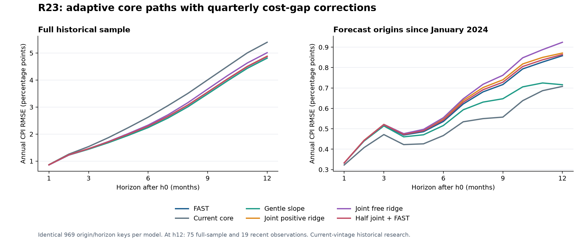
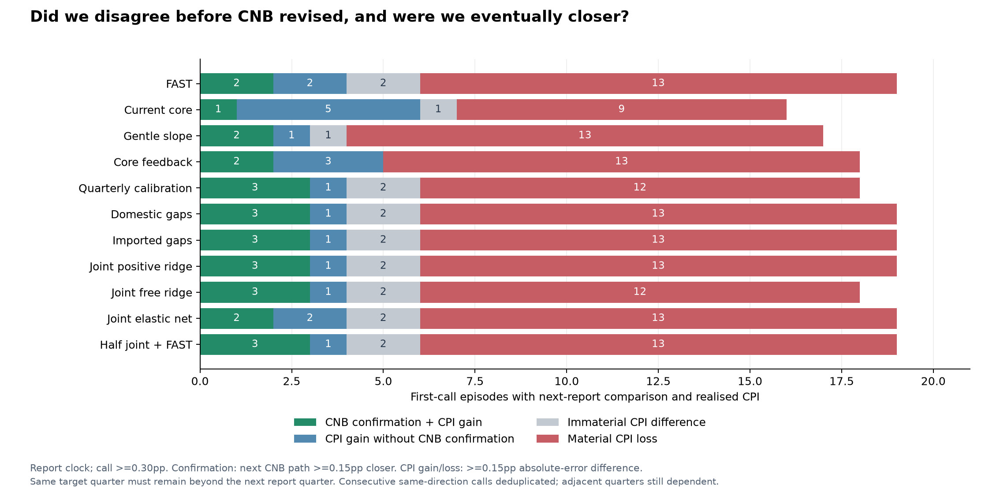
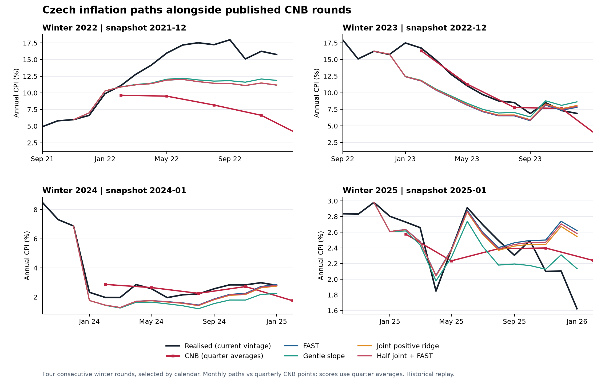

# CZK CPI Forecasting — R23 path results

16 September 2026. **Seven new path candidates tested; none promoted.** All 90 historical origins from February 2019 through July 2026 were fitted. The independent next-release forecast, food, fuel, administered prices, alcohol/tobacco and weights are unchanged.

The useful outcome is a cleaner experiment and a direct test of the objective: can an independent forecast flag a meaningful disagreement before CNB changes its forecast, and also be materially closer to the eventual inflation print? There are examples, but the overall record does not yet support a dependable CNB-leading signal.

[Interactive CNB rounds](output/research_r23/final/evaluation/cnb_rounds_replayed_r23.html) · [Claude handoff](HANDOFF_TO_CLAUDE_R23_2026-09-16.md) · [Frozen specification](docs/implementation/R23_COST_GAPS_SPEC_2026-09-16.md) · [Independent review](work/research_r23_review/REVIEW.md)

## What was tested

FAST already estimates an adaptive core trend plus a mean-reverting cycle. R23 asks whether observed upstream cost pressure improves its future core path. Every candidate uses exactly the saved FAST seasonal pattern; this removes the seasonal-comparison problem found in R22.

The domestic channel uses a quarterly unit-labour-cost gap and falling unemployment. The imported channel uses relative import prices, manufacturing producer prices and exchange-rate changes since the latest import-price measurement. A cost gap means the cost index relative to core consumer prices, compared with its own trailing median. It is a statistical pressure measure, not an identified equilibrium markup.

| Candidate | Addition to FAST |
|---|---|
| Quarterly calibration | An intercept-only correction estimated on the same quarterly training origins |
| Domestic gaps | Unit labour costs and unemployment; nonnegative predictor coefficients |
| Imported gaps | Imports, PPI and FX; nonnegative predictor coefficients |
| Joint positive ridge | All five features, with shrinkage and nonnegative predictor coefficients |
| Joint free ridge | The same predictors without sign restrictions |
| Joint elastic net | The same predictors, with coefficient shrinkage and possible exclusion |
| Half joint + FAST | Half the joint correction in monthly log-core space |

Four equations predict the average FAST core error over months 1–3, 4–6, 7–9 and 10–12. A fixed interpolation produces twelve monthly corrections while preserving those four averages exactly. Those core predictions then enter the existing headline accounting. **This HALF is a path experiment; it is not the separate nowcast HALF model.**

Quarterly ULC remains quarterly. Training uses one origin per calendar quarter and 28–40 eligible rows in this batch. Every training origin's entire twelve-month outcome must already have been published. Regularization is chosen by nested chronological validation using each inner origin's own information cutoff, never the outer outcome. Inputs are masked before transformation. Missing required history falls back to FAST; no evaluated origin needed that fallback.

Sources are the frozen CNB core series, Eurostat unemployment and manufacturing PPI, the existing Bloomberg quarterly ULC history, CZSO import prices and monthly EUR/CZK. No survey, CNB projection or future realised driver enters these forecasts. Whole-economy ULC and broad import/PPI indices are imperfect measures of costs in the core basket. Separate wage and productivity equations and a proper services/goods measurement system were not built in R23.

The economic motivation comes from [CNB's discussion of domestic costs, imported costs and delayed price adjustment](https://www.cnb.cz/en/monetary-policy/monetary-policy-reports/boxes-and-articles/Pricing-and-its-importance-for-monetary-policy-from-the-perspective-of-the-g3-model/) and quarterly cost equations illustrated in the [ECB January 2025 Bulletin, pp39–40](https://www.ecb.europa.eu/pub/pdf/ecbu/eb202501.en.pdf). These motivate a test; R23 is not a replication of either system.

## Forecast accuracy

Annual CPI RMSE in percentage points; lower is better. Identical support within each column. Full-sample h3/h6/h12 counts are 84/81/75; recent counts are 28/25/19. The complete scoreboard preserves 969 origin/horizon keys per model.

| Path | Full h3 | Full h6 | Full h12 | 2024+ h3 | 2024+ h6 | 2024+ h12 |
|---|---:|---:|---:|---:|---:|---:|
| FAST | 1.4592 | 2.2903 | 4.8695 | .5178 | .5358 | .8580 |
| Current core | 1.5373 | 2.6243 | 5.3972 | .4716 | .4667 | .7077 |
| Gentle slope | 1.4387 | 2.2395 | 4.8101 | .5139 | .5159 | .7159 |
| R21 core feedback | 1.4336 | 2.2234 | 4.8105 | .5321 | .5489 | .8004 |
| Quarterly calibration | 1.4560 | 2.2782 | 4.8442 | .5160 | .5363 | .8885 |
| Domestic gaps | 1.4608 | 2.2967 | 4.8827 | .5217 | .5500 | .8712 |
| Imported gaps | 1.4572 | 2.2860 | 4.8827 | .5174 | .5357 | .8630 |
| Joint positive ridge | 1.4604 | 2.2960 | 4.8839 | .5217 | .5500 | .8712 |
| Joint free ridge | 1.4601 | 2.3315 | 5.0116 | .5209 | .5542 | .9239 |
| Joint elastic net | 1.4659 | 2.3450 | 5.0433 | .5178 | .5358 | .8580 |
| Half joint + FAST | 1.4597 | 2.2927 | 4.8758 | .5197 | .5428 | .8639 |

The cost channels do not beat the simpler references consistently. Removing sign restrictions hurts full-sample accuracy. Elastic net shrinks back to FAST on the recent sample. The joint fit chooses the strongest ridge penalty at 55 of 90 origins; this is evidence that its chronological validation often prefers a small correction, not proof that labour costs have no economic effect.

Core accuracy also fails to justify promotion. Full-sample cumulative log-core h12 RMSE is 4.1963 for FAST versus 4.3554 for joint; recent values are .5865 and .5993. The calibration-only candidate's tiny full-sample headline gain therefore does not establish better underlying-core forecasting.

All seven full-sample h12 paired-loss bootstrap intervals include zero. Leaving out one origin year can change the sign of every candidate's h12 comparison with FAST. The recent h12 panel has only 19 overlapping observations: twelve-month block bootstrap intervals are particularly fragile there and are descriptive, not decisive inference. No interval corrects for the many prior research rounds.

## Did we get ahead of CNB?

The new test freezes our forecast at each existing report/cutoff clock. The report clock selects the last archived snapshot strictly before the report day; the cutoff clock uses snapshots available by the end of CNB's stated cutoff day. It compares the immediately following CNB report for the **same target quarter**, which must still be strictly beyond that next report's calendar quarter.

- A call requires at least .30pp distance from the current CNB forecast; .50pp is a separately reported sensitivity.
- Revision confirmation requires the next CNB revision to have our sign and move at least .15pp closer to our original forecast. Direction agreement is also reported separately; an overshoot can agree in direction without confirming our magnitude.
- A material accuracy gain means at least .15pp less absolute error than the original CNB forecast. A loss is the converse.
- A joint success satisfies both confirmation and material accuracy. Calls with missing future comparisons and unmatured outcomes remain visible in the exports.

The table counts the first call in each consecutive same-direction sequence for a target quarter, at the report clock and .30pp threshold. These are **not independent economic turning points**: adjacent target quarters can share one shock, and different models need not make calls on the same dates.

| Path | Eligible first calls | Calls with actuals | Material gains | Material losses | Joint successes |
|---|---:|---:|---:|---:|---:|
| FAST | 21 | 19 | 4 | 13 | 2 |
| Current core | 17 | 16 | 6 | 9 | 1 |
| Gentle slope | 18 | 17 | 3 | 13 | 2 |
| R21 feedback | 20 | 18 | 5 | 13 | 2 |
| Quarterly calibration | 20 | 18 | 4 | 12 | 3 |
| Joint positive ridge | 21 | 19 | 4 | 13 | 3 |
| Half joint + FAST | 21 | 19 | 4 | 13 | 3 |

Joint's three successes occur in only **two report rounds**:

| Original CNB report | Target | CNB then | Joint then | Next CNB | Realised | Joint absolute-error gain |
|---|---|---:|---:|---:|---:|---:|
| 10 Feb 2022 | 2022 Q3 | 8.17 | 11.52 | 13.86 | 17.58 | 3.35pp |
| 10 Feb 2022 | 2022 Q4 | 6.63 | 11.26 | 12.75 | 15.70 | 4.63pp |
| 8 Aug 2024 | 2025 Q2 | 1.75 | 2.27 | 2.57 | 2.38 | .52pp |

The first two were already successful FAST calls. They are two quarters of one report, not two independently anticipated shocks, and do not show that the model predicted the subsequent war. The August 2024 case is relevant to the user's objective: the model identified upward risk before the next CNB report and was materially closer to eventual inflation. FAST also had a useful forecast in that case; R23's extra joint-success count crosses the fixed distance-confirmation threshold. It is not a newly discovered reversal of the FAST view. See the full-precision same-target comparison in `output/research_r23/diagnostics/summer_2024_same_target_all_models.csv`.

Failures matter just as much. In May 2023, joint predicted 6.03% for 2024 Q1 against CNB's 2.50%; the outcome was 2.09%, producing a 3.53pp material loss. In May 2025, it predicted 3.00% for 2026 Q1 against CNB's 2.30%; CNB subsequently moved upward toward us, but actual inflation was 1.62%. That is revision confirmation **with worse accuracy**, not success.

At the cutoff clock, joint has the same 3 joint successes from 19 matured first calls and 13 losses. At the report clock with a .50pp threshold, it has 3/18 with 12 losses. For reports from 2024 onward at .30pp, it has 1/8 with 5 losses. The overall verdict is unchanged. These denominators count scored first calls, not all available CNB projections; coverage and omitted comparisons are separately exported.

On all 66 full-sample matched CNB report-clock pairs, joint's RMSE is 1.9949 versus CNB's 2.2955, but its MAE is worse: 1.2875 versus 1.0605. Removing individual reports can reverse the RMSE advantage; its MAE remains worse in every one-report omission. On 34 recent pairs, CNB also wins RMSE: .3718 versus .4927. A few large historical gains cannot be presented as general superiority.

The separate strict underlying-core reversal test finds **zero exact-band hits for every candidate**. The unrestricted ridge and elastic net generate one and three false turns respectively; joint makes no qualifying turn calls. Its 77 observed turn labels come from overlapping origin/band observations, not 77 distinct macroeconomic events. Headline revision leadership and predicting a core peak/trough are different tests.

## What I would use and what to investigate next

Keep FAST, current core and gentle slope as the compact path reference set; retain R21 feedback as a research comparison. Current core's recent accuracy and gentle slope's full/recent compromise are useful, but selecting whichever wins a displayed panel is not a validated regime-switching rule. R23 adds no operating replacement. Keep the independent nowcast BASE/HALF/FULL roster unchanged; path results cannot establish a next-release surprise edge.

My diagnosis is that the information mapping is now more limiting than model flexibility. Aggregate relative-cost gaps, delayed quarterly labels and a smooth correction struggle to locate turns. There is no evidence here that a wider alpha grid, more forests or removing sign constraints would solve this.

The next bounded research design should separate two problems:

1. **A faster-moving pressure measure.** Use a released-data services/domestic-cost versus imported-goods measurement system, with actual quarterly wages and productivity distinct where obtainable. Allow partial recent quarters through an explicit measurement equation, not linear interpolation. Keep energy-policy start/expiry accounting separate so base effects do not masquerade as core turns. First establish that the measured states improve component forecasts.
2. **Horizon-specific adaptation and a selective disagreement record.** R23 waits for twelve months of outcomes even to learn its h1–3 correction. A predeclared band-specific maturity rule could learn the short band sooner, with its own chronological validation. Shared coefficients or shrinkage across bands could limit the resulting variance. Score every resulting CNB disagreement and every abstention; do not discover a favourable alert rule using the three successful episodes above.

Those are proposals, not tested gains. A prospective ledger should record the forecast, named pressure, threshold and intended target quarter before the next CNB report, then record next-CNB and eventual-CPI outcomes separately. This is the cleanest way to develop evidence for occasional useful leadership without requiring the model to predict unforeseeable shocks. Scenario analysis should explain exposure to such shocks rather than reclassify all bad forecasts after the event.

## Verification and limits

**25 targeted regression tests passed.** Independent review reconstructed all 90 fits, coefficients, band interpolation, original h0/noncore accounting, all 969 primary keys per model, and the CNB lead joins/denominators. Three direction/provenance edge cases were corrected before scoring. Their fixes left the fitted forecasts byte-identical. No model specification or threshold was changed after inspecting results.

This is current-vintage historical research with reconstructed availability, overlapping errors and extensive prior research exposure. It is not an untouched holdout, a live record or a rates P&L test. Publication-day rules remain enforced; intraday-hour precision is not treated as a blocker, in line with the user's instruction. The complete code, inputs, evidence and reproduction commands are mapped in the Claude handoff; `output/research_r23/DELIVERY_MANIFEST.json` seals the delivered files and verifies the earlier deliveries remain unchanged.
